# 📚 Library Management System: Manage Books with Ease

## 🌟 Project Overview
This Library Management System simplifies book management, borrowing, and returning processes for both admins and users. Built using **Node.js**, **Express.js**, **MongoDB**, **React.js**, and **Tailwind CSS**, it provides a secure and intuitive interface for library administrators and users to manage books, transactions, and accounts seamlessly.

---

## 🎯 Problem Statement
Traditional library systems often face:
- **Inefficient Book Management**: Manual tracking leads to errors and delays.
- **Limited User Interaction**: Users lack easy access to book availability and their borrowing history.
- **Security Concerns**: Inadequate authentication can compromise user data.

---

## 💡 Solution: Library Management System
This project offers the following features:
- **JWT-based Authentication** for secure login.
- **Role-based Access**: Admins manage books and transactions; users borrow and return books.
- **Responsive UI** built with **React.js** and **Tailwind CSS**.
- **MongoDB Integration** for robust data storage.
- Comprehensive **CRUD Operations** for books and transactions.

---

## 🚀 Features
### Admin:
- Add, update, and delete books.
- View dashboard statistics (total books, borrowed books, available books).
- Manage transactions.

### User:
- Register and login.
- View available books.
- Borrow and return books.
- View personal transaction history.

---

## 🛠️ Built With
### Backend:
- **Node.js**
- **Express.js**
- **MongoDB**
- **JWT** for authentication
- **Bcrypt** for password security

### Frontend:
- **React.js**
- **Tailwind CSS**

---

## ⚙️ Project Architecture
### Backend API Endpoints:
1. **User Routes:**
   - `POST /api/v1/users/register`: Register a new user.
   - `POST /api/v1/users/login`: Login a user.

2. **Book Routes:**
   - `POST /api/v1/books/addBook`: Add a new book (Admin only).
   - `GET /api/v1/books/getBooks`: Get all books.
   - `PUT /api/v1/books/:bookId`: Update a book (Admin only).
   - `DELETE /api/v1/books/:bookId`: Delete a book (Admin only).

3. **Transaction Routes:**
   - `POST /api/v1/transactions/borrow`: Borrow a book.
   - `POST /api/v1/transactions/return`: Return a book.
   - `GET /api/v1/transactions/`: Get all transactions (Admin only)..
   - `GET /api/v1/transactions/user/:userId`: Get transactions by user ID.

4. **Dashboard Route:**
   - `GET /api/v1/dashboard/`: View dashboard statistics (Admin only).

---

## 🎨 Visual Showcase
**Login & Registration:**
- **Login Page**
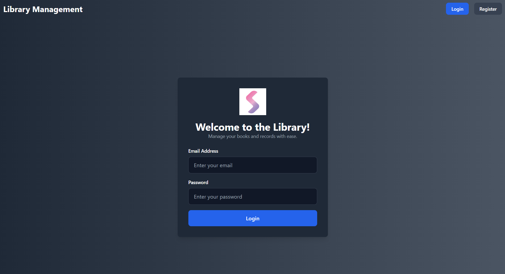
- **Register Page**


**Book Management:**
- Add, update, and delete books.
- **Add Book**

- **Update Book**


**Transactions:**
- View all borrowing and returning activities.


**Admin Dashboard:**
- Manage books and transactions effortlessly.
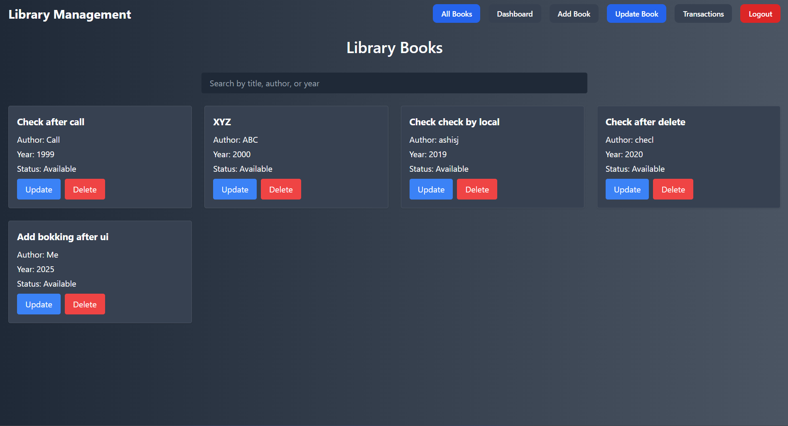
- **Admin Dashboard**


**User Dashboard:**
- **Get All Books**
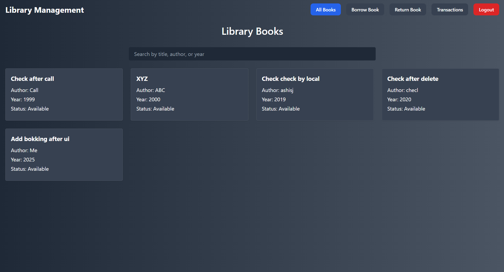

- **Borrow Book**
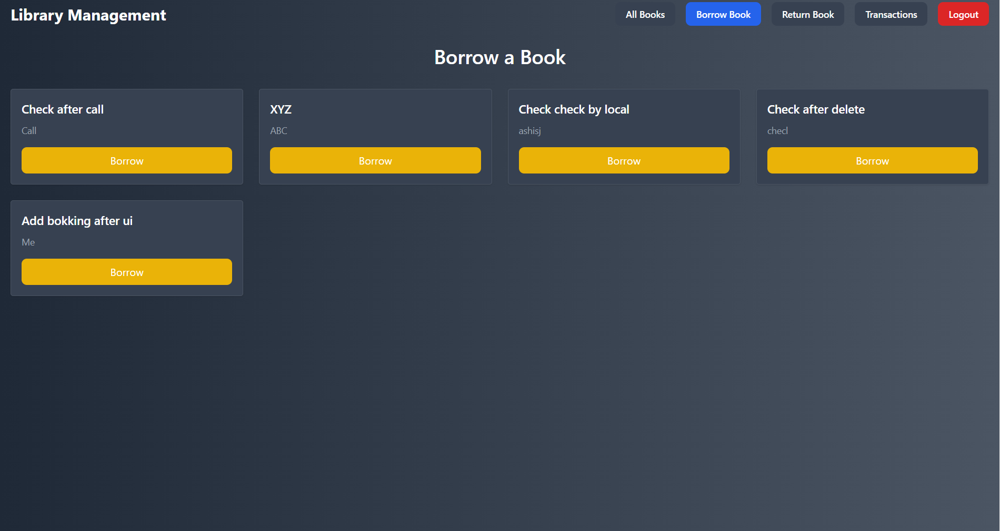

- **Return Book**


- **User Transactions**
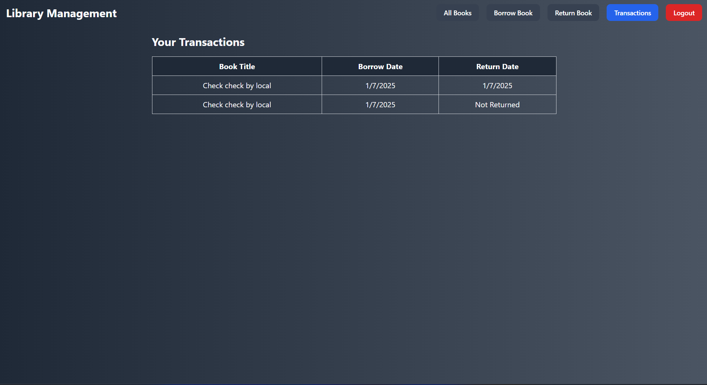

---

## 🛠️ Setting Up the Project
### Prerequisites
- Install **Node.js** (v16+ recommended).
- Set up **MongoDB** (local or cloud instance).

### Backend Setup:
1. Navigate to the backend folder:
   ```bash
   cd ../server
   ```

2. **Create a `.env` file** with the following variables:
    ```env
    PORT=5000
    MONGO_URI=<your-mongodb-uri>
    JWT_SECRET=<your-secret-key>
    ```

3. **Start the backend server**:
    ```bash
    npm run start
    ```

### Frontend

1. **Navigate to the frontend directory**:
    ```bash
    cd ../client
    ```

2. **Install dependencies**:
    ```bash
    npm install
    ```

3. **Start the development server**:
    ```bash
    npm run dev
    ```

---

## 🖼️ MongoDB Collection Snapshots

- **User Document Collection**  
   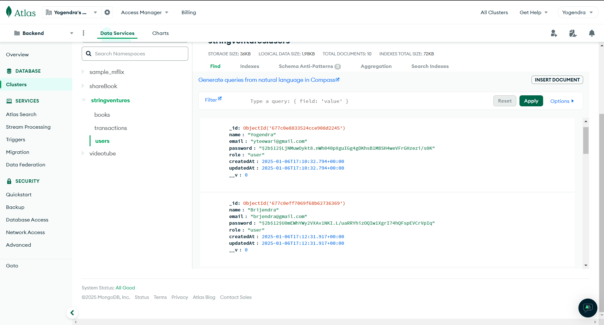

- **Book Document Collection**  
   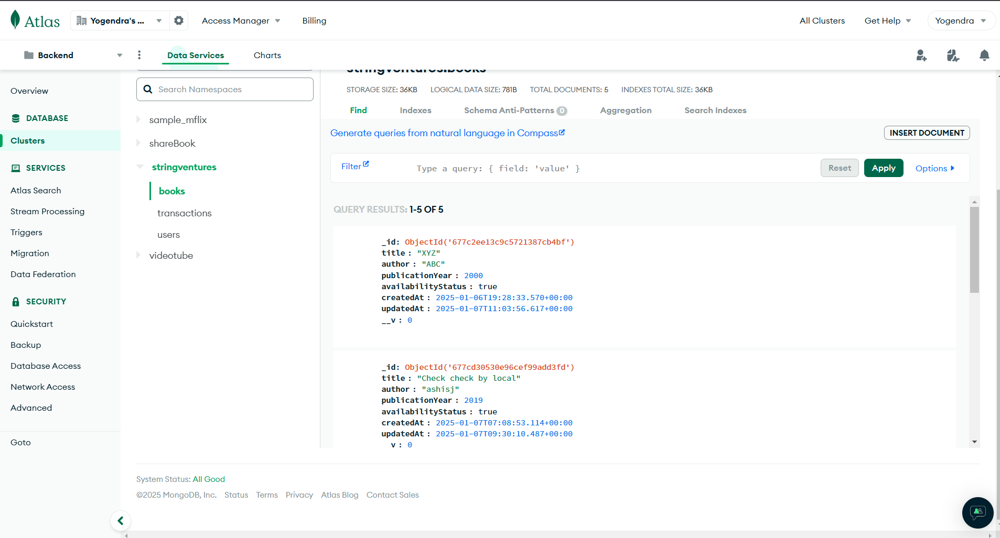

---

## 🛠️ Postman Testing Snapshots

- **Postman Testing: Register API**  
   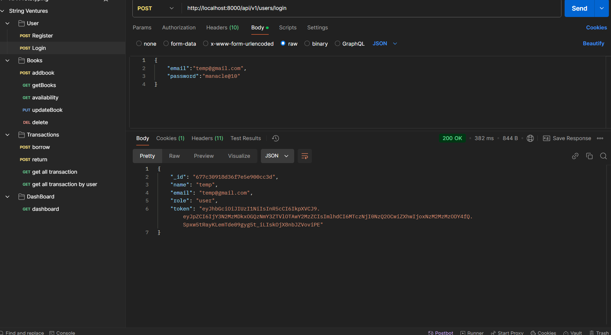

- **Postman Testing: Login API**  
   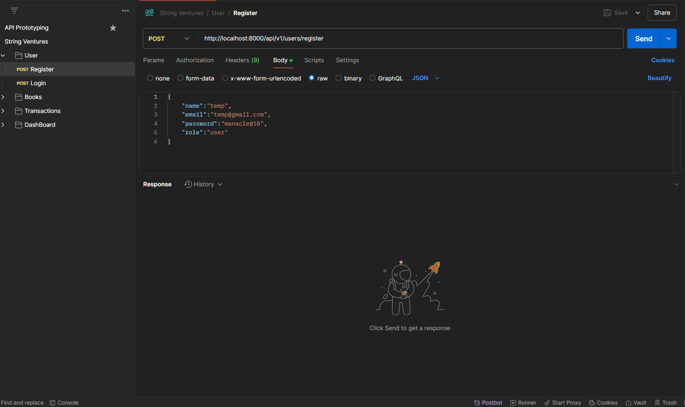

- **Postman Testing: Get All Books**  
   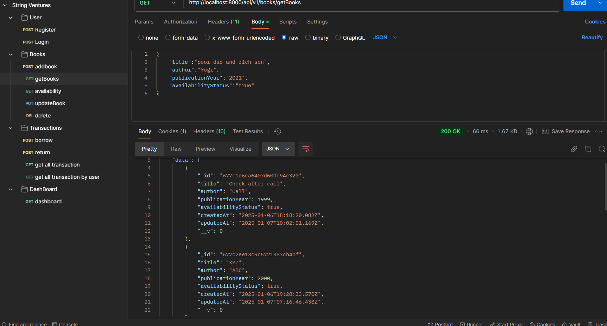

- **Postman Testing: Add Book API**  
   

- **Postman Testing: Update Book API**  
   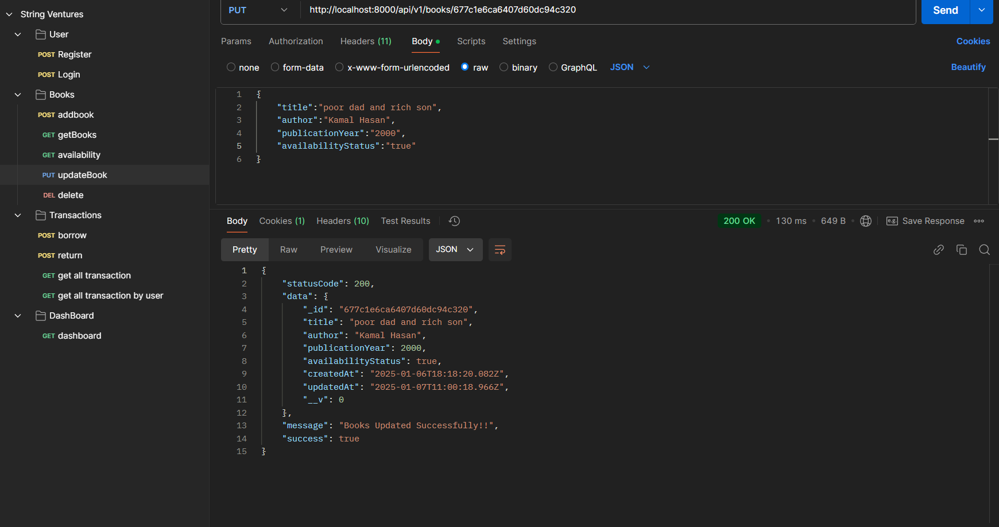

- **Postman Testing: Delete Book API**  
   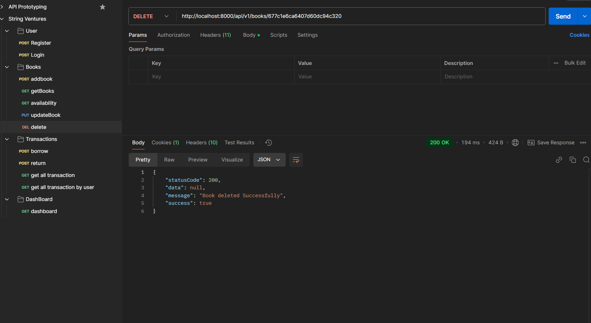

- **Postman Testing: Borrow Book API**  
   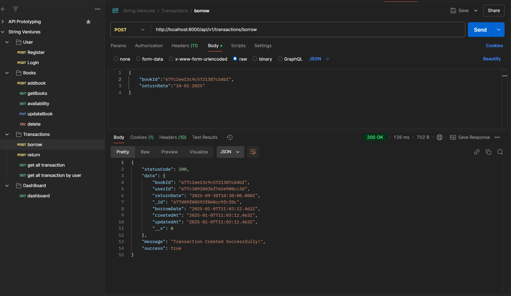

- **Postman Testing: Return Book API**  
   

- **Postman Testing: All Transactions API**  
   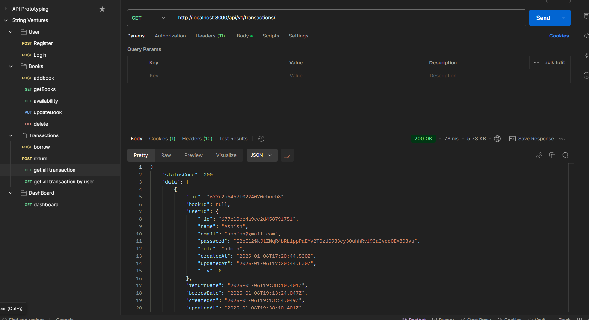

---

## 🤝 Contributing

We welcome contributions! Follow these steps:

1. Fork the repository.
2. Create a feature branch:
    ```bash
    git checkout -b feature-name
    ```
3. Commit and push your changes:
    ```bash
    git commit -m "Add feature-name"
    git push origin feature-name
    ```
4. Open a pull request.

---

## 🤝 Let's Connect

Have ideas or feedback? I’d love to hear from you!
- **Email**: yteewari@gmail.com
- **Linkedin**: https://www.linkedin.com/in/yogendra-teewari/
- **GitHub**: https://github.com/yogit4554
